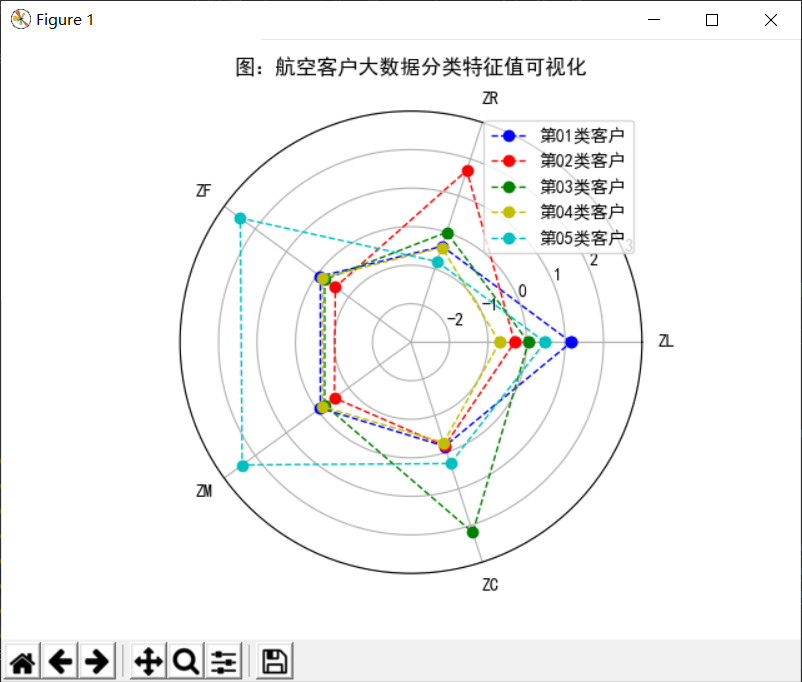

# 数据处理
需要使用到的重要数据信息：(所有数据详见air_data.csv)

**客户基本信息** 
特征名称 | 特征说明
:- | -
MEMBER_NO | 会员卡号
FFP_DATE | 入会时间
FIRST_FLIGHT_DATE | 第一次飞行日期
GENDER | 性别
FFP_TIER | 会员卡级别
WORK_CITY | 工作地城市
WORK_PROVINCE | 工作地所在省份
WORK_COUNTRY | 工作地所在国家
AGE | 年龄

**飞行基本信息**
特征名称 | 特征说明
:- | -
FLIGHT_COUNT | 观测窗口内的飞行次数
LOAD_TIME | 观测窗口的结束时间
LAST_TO_END	|最后一次乘机时间至观测窗口结束时长
AVG_DISCOUNT | 平均折扣率
SUM_YR | 观测窗口的票价收入
SEG_KM_SUM | 观测窗口的总飞行公里数
LAST_FLIGHT_DATE | 末次飞行日期
AVG_INTERVAL | 平均乘机时间间隔
MAX_INTERVAL | 最大乘机间隔

**积分基本信息**

特征名称 | 特征说明
:- | -
EXCHANGE_COUNT	|	积分兑换次数
EP_SUM		|	总精英积分
PROMOPTIVE_SUM	|	促销积分
PARTNER_SUM	|	合作伙伴积分
POINTS_SUM	|	总累计积分
POINT_NOTFLIGHT	|	非乘机的积分变动次数
BP_SUM		|	总基本积分

## 选择的分类模型：
一般商业模式识别客户价值的模型：RFM模型。

R（Recency）指的是最近一次消费时间与截止时间的间隔。通常情况下，最近一次消费时间与截止时间的间隔越短，对即时提供的商品或是服务也最有可能感兴趣。

F（Frequency）指顾客在某段时间内所消费的次数。可以说消费频率越高的顾客，也是满意度越高的顾客，其忠诚度也就越高，顾客价值也就越大。

M（Monetary）指顾客在某段时间内所消费的金额。消费金额越大的顾客，他们的消费能力自然也就越大，这就是所谓“20%的顾客贡献了80%的销售额”的二八法则。

## 航空行业商业模式的特殊性：
在RFM模型中，消费金额表示在一段时间内，客户购买该企业产品金额的总和，由于航空票价受到运输距离，舱位等级等多种因素影响，同样消费金额的不同旅客对航空公司的价值是不同的，因此这个特征并不适合用于航空公司的客户价值分析。

1. 选择客户在一定时间内累积的飞行里程M和客户在一定时间内乘坐舱位所对应的折扣系数的平均值C两个特征代替消费金额。
2. 在模型中增加客户关系长度L，作为区分客户的另一特征。因为航空公司会员入会时间的长短在一定程度上能够影响客户价值。

将客户关系长度L，消费时间间隔R，消费频率F，飞行里程M和折扣系数的平均值C作为航空公司识别客户价值的关键特征，记为LRFMC模型。

模型 | 航空公司LRFMC模型
:- | -
L | 会员入会时间距观测窗口结束的月数
R |	客户最近一次乘坐公司飞机距观测窗口结束的月数
F |	客户在观测窗口内乘坐公司飞机的次数
Ms | 客户在观测窗口内累计的飞行里程
C |	客户在观测窗口内乘坐舱位所对应的折扣系数的平均值

数据处理流程：
1.	数据探查----------找出每个数据项最大值和最小值、空值等情况
2.	数据清洗----------删除掉无意义数据，详见代码注释
3.	数据降维----------根据LRFMsC模型，提取出FFP_DATE、LOAD_TIME、FLIGHT_COUNT、AVG_DISCOUNT、SEG_KM_SUM、LAST_TO_END六个特征值
4.	数据标准化--------采用Z-score标准化将数据表示为每个特征在所以数据中的数量占比
5.	数据聚类-----------采用K-Means算法进行聚类，雷达图表示的结果如下：
6. 定义五个等级的客户类别：重要保持客户，重要发展客户，重要挽留客户，一般客户，低价值客户。
分类依据:客户群5：F、M指标为优势指标：重要保持客户
         客户种类3：C指标为优势指标：重要发展客户
         客户种类2：R指标为弱势指标:重要挽留客户
         客户种类1：L指标较高：一般客户
         客户种类4： 低价值客户

